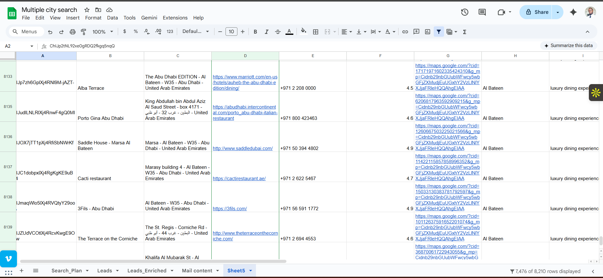

# Lead Enrichment + Outreach Automation Pipeline (8,000 plus Leads)

## Overview
This project is an end-to-end automation pipeline that takes a raw lead list, enriches each lead from their website, and produces outreach-ready messaging — all while keeping the entire process trackable inside a single Google Sheet.

The goal wasn’t “send emails faster.”
The goal was to solve a real operational problem: **turn messy lead data into usable, personalized outreach at scale** without losing control of quality.

---

## The Problem
A client had thousands of potential leads but the list was unusable because:

- Many entries were missing key business details  
- Emails were often unavailable or hidden across different pages  
- Manual research was slow and inconsistent  
- Outreach couldn’t be personalized at scale  
- Tracking what happened per lead (enriched? emailed? skipped?) was messy  

So the real problem was:  
> **How do we convert a raw lead list into enriched, outreach-ready records at scale — with quality, traceability, and minimal manual work?**

---

## What This Pipeline Does
Given a list of businesses (starting from scraped websites), the system:

1. **Enriches each lead**
   - Scrapes website content  
   - Searches for emails and contact information  
   - Pulls useful context (what they do, location hints, keywords, signals)  

2. **Classifies the lead**
   - If an email is found → prepare a personalized outreach email  
   - If no email is found → prepare a “Contact Us” message tailored to the business  

3. **Generates outreach copy**
   - Uses the website context to avoid generic spammy messages  
   - Keeps messaging aligned to the client’s offer and ICP  
   - Outputs ready-to-send text  

4. **Writes everything back to a single sheet**
   - Enrichment fields  
   - Email found (or not)  
   - Outreach email OR contact-us message  
   - Status fields for tracking  

---

## Pipeline Logic (How It Thinks)
The system follows a simple decision chain:

- **Input:** business website URL  
- **Extract:** website content + contact signals  
- **Decision:**  
  - **If email exists:** generate outreach email  
  - **Else:** generate contact-us message  
- **Store:** save output + status per lead in Google Sheets  

This structure ensures:
- every lead has an outcome  
- no lead “disappears”  
- the pipeline is auditable and resumable  

---

## Workflow / Flow Design (High Level)

**Step 1 — Lead Intake**  
Start with ~8,000 businesses and their websites (scraped upstream)

**Step 2 — Website Enrichment**  
Fetch website pages (homepage + key pages like contact/about) and extract:
- emails (if available)  
- business description/context  
- extra signals (location, niche, offerings)  

**Step 3 — Routing**  
- If email is found → Outreach Email Path  
- If email is not found → Contact Form Message Path  

**Step 4 — Message Generation**  
Outreach Email Path:
- personalized opening line using site context  
- clear offer  
- simple call-to-action  

Contact Form Path:
- shorter message optimized for forms  
- still personalized and relevant  

**Step 5 — Write to Google Sheets**  
Append enriched fields + generated copy and mark lead status:
- enriched ✅  
- email_found ✅/❌  
- outreach_ready ✅  

**(Optional – Next Level)**  
**Step 6 — Human Approval + Sending Layer**
- Outreach drafts are reviewed by a human inside the sheet or a simple dashboard  
- Approved messages are automatically sent via email provider (Gmail/SMTP/ESP)  
- Status updates written back to the sheet (approved, sent, replied)  

This keeps quality high while still allowing full automation at scale.

---

## Output Schema (Saved to Sheet)
Each row becomes a complete outreach-ready record:

- Website  
- Business name (if detected)  
- Niche / keywords  
- Location (if detected)  
- Email(s) found  
- Source page where email was found (when possible)  
- Outreach email draft (if email exists)  
- Contact-us message (if email missing)  
- Status / timestamps (for monitoring + reruns)  

---

## Results
**Processed:** ~8,000 leads end-to-end  

**Delivered:**
- structured enriched lead list  
- email extraction + context fields  
- outreach-ready messages for leads with emails  
- contact-us messages for leads without emails  
- single-sheet tracking system for handoff and execution  

---

## Client Impact
This automation reduced manual work and made outreach operationally scalable:

- eliminated repetitive research across thousands of websites  
- ensured every lead had an action (email or form message)  
- improved outreach quality by using real website context  
- made lead handling traceable in one system (Google Sheet)  
- enabled faster campaign launches with less effort and fewer errors  

---

## Why This Matters (The Real Value)
The win here wasn’t “automation.”
It was building a **reliable lead-to-outreach system** that:

- scales without collapsing quality  
- produces consistent outputs  
- can be resumed, audited, and improved  
- turns raw data into execution-ready work  

---

## Notes / Future Improvements
- Add domain-level deduplication  
- Add confidence scores for extracted emails  
- Add verification (MX checks / deliverability checks)  
- Add CRM push (HubSpot, Pipedrive, etc.)  
- Add full human-in-the-loop approval and auto-sending as a standard module  

---

## Tech (Implementation Detail)
Implemented as a workflow automation system with:
- web scraping + extraction  
- routing logic for email vs no-email cases  
- message generation  
- Google Sheets as the final source of truth  

(Exact tooling can vary depending on the client stack — the logic stays the same.)

## Demo Screenshots

